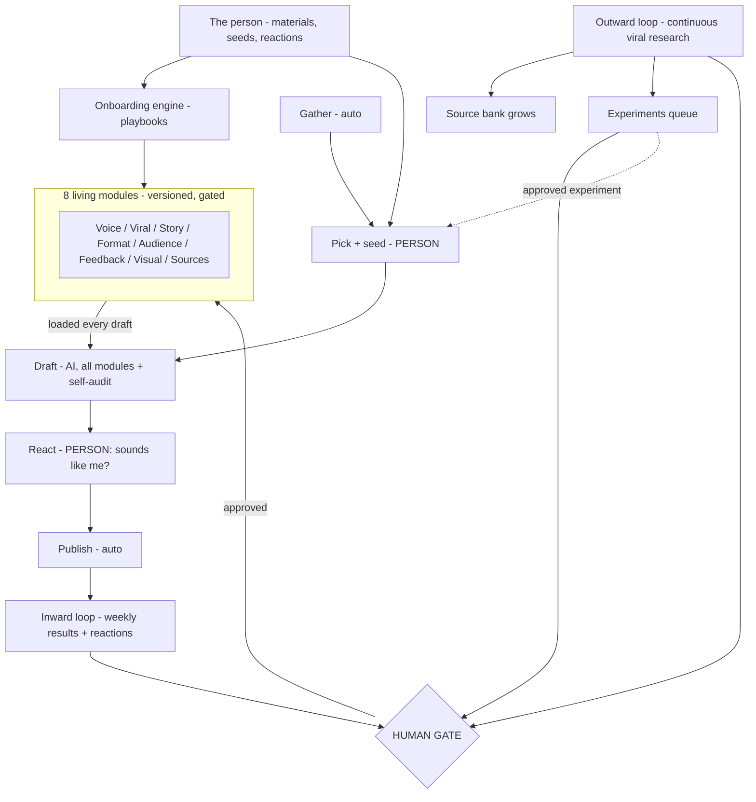

# StackPenni Build Charter — v3

*The guiding document for building the content system. Any AI or collaborator reads this before working on the system.*
*v3 — 2026-07-01 — supersedes v2. Adds: the human role redefined as originate + react; the Onboarding Engine (playbooks); the repeatability rule; the build architecture (Claude architect / Hermes builder / GitHub channel); open-source model policy.*

## What this is

A content co-creation system any entrepreneur can use. StackPenni — a Caribbean AI + wealth brand (X / Instagram; sub-brands Island Futurist, Digital Sou-Sou, Caribbean Receipts) run by Daimon — is user #1, not the only intended user. **The harness is generic; the modules are the business.** Nothing business-specific is ever hardcoded: every judgment lives in a playbook or module, every value lives in config.

## North Star

A machine that co-creates viral-capable content with a person who supplies ideas and taste but does not produce. Output must read — **and look** — as made by a specific human for a human, rooted in that person's lived domain, at a pace sustainable for a **solo, non-creator, non-developer operator**.

## The human role: originate + react — never produce

The system does not assume the person can write, design, or edit. It assumes only three things any domain expert has:

1. **Seeds** — ideas, opinions, stories, real numbers. Spoken is preferred (a 30-second voice note is a perfect seed); messy is fine. The system builds the finished piece around the seed.
2. **Reactions** — taste as recognition, not creation. The person doesn't fix drafts; they react in plain words ("that word isn't me", "too polished", "ending is weak"). The drafter self-audits against the Tells Checklist and presents suspect lines, so the person judges flagged items rather than hunting for problems. Reactions feed the Feedback Log.
3. **Lived material** — phone footage, receipts, screenshots, real artifacts. No craft required.

If a person could already produce great content alone, they wouldn't need this system. It is designed for the idea-rich, production-poor operator — which is most entrepreneurs.

## The repeatability rule

**If an AI does something once in a chat, it must be written down as a playbook the system can run for user #2.** No module is ever built by ad-hoc AI judgment that isn't captured. Onboarding is itself a pipeline with the same human gates as everything else.

## The Onboarding Engine (playbooks)

For every module there is a **playbook**: a written procedure + prompt templates + output schema that the system's AI executes for any user, from whatever materials that user has. Playbooks are text files in the repo (`playbooks/`), not code.

- **Material-agnostic intake.** One user has WhatsApp exports and email; another has a podcast, LinkedIn posts, or nothing. Every playbook lists accepted inputs and a fallback (e.g., a guided interview that elicits natural speech) when the user has no corpus.
- **The system is the interface.** Users interact through the system's own web console — log in, upload materials, review drafts, react, approve. No user ever needs Claude chat, Claude Code, or any external AI tool.
- **Calibration closes every playbook.** The AI's draft module is tested against the user (e.g., "here are 3 short pieces in your candidate voice — which is closest, what's off?") and revised before v1 is stored. The gate applies to onboarding too.
- **Playbooks exist for at minimum:** Voice Profile builder · Source discovery (find the feeds/accounts/channels for this business) · Domain research setup (what the outward loop monitors for this subject area) · Audience Insights builder · Story Frameworks starter · Visual Style intake. Each produces a versioned module.

## What makes content read and look human

1. **A specific detail only this person could know, in every piece** — the human seed; the single biggest lever.
2. **Voice from real samples, not adjectives.** Natural speech (voice notes, chats, dictation) is a truer source than edited writing — it is unperformed. The Voice Profile playbook extracts concrete patterns with evidence: rhythm, transitions, habitual phrases, dialect features to preserve (never sanitize), and anti-patterns.
3. **A human reaction pass.** AI tells are rhythm and structure. The drafter self-audits against the Tells Checklist; the person reacts to flagged lines; the system revises.
4. **Real footage anchors visual trust** (see Video & images).

**Humanness is built in, not sprayed on.** No bolt-on humanizer. Structural humanness lives in the Voice Profile + Tells Checklist + reaction pass, upstream.

## The living modules (the accumulating intelligence)

Eight versioned documents per business, stored in the knowledge layer (OB1 for user #1), loaded into every draft, updated only through the human gate:

1. **Voice Profile** (incl. Tells Checklist) · 2. **Viral Patterns Playbook** · 3. **Story Frameworks** · 4. **Format Guide** · 5. **Audience Insights** · 6. **Feedback Log** · 7. **Visual Style Guide** · 8. **Source Bank**

Every module has: a fixed schema (so the drafter loads it reliably), a version number, a provenance note (what evidence produced each entry), and an update path through the gate.

## The core loop

1. **Gather** — automated
2. **Pick + seed** — person: choose + spoken lived take
3. **Draft** — AI, all modules loaded, self-audited against Tells Checklist
4. **React** — person: judge flagged lines, plain-words feedback; AI revises; ship or kill
5. **Publish** — automated
6. **Learn** — two loops (below)
7. **Improve** — gate-approved proposals update modules; every future draft inherits them

## The learning system (two loops, one gate)

**Inward loop — weekly.** AI reads published results + the Feedback Log; proposes specific module updates. Person approves/rejects in one sitting.

**Outward loop — continuous.** Scheduled research of what works in the wild for this subject area: monitors top accounts/hashtags/channels (per the domain research module built at onboarding), pulls top performers via APIs/scrapers, analyzes hook/structure/format/emotion/pacing. Findings flow to: the **Source Bank** (self-growing), **proposed updates** to Viral Patterns / Format Guide / Story Frameworks, and the **Experiments Queue** (untried formats become proposed experiments, run deliberately, results feed the inward loop — exploration built in, the cure for the convergence trap).

**Honesty rules:** external virality is observable, its cause is inference — findings enter as hypotheses; own-account data is small and noisy — no automatic optimization; the gate is one sitting per week — if longer, fix the proposal prompt, not the gate. Autonomy is earned as proposals prove out, never assumed.

## Video & images — hybrid, real-anchored

Real phone footage is the anchor and trust signal; anything claiming lived experience must be real. Generated video (Veo-class) is the supporting layer — b-roll, concept visuals — preferably brand-stylized over fake-documentary realism. Follow platform AI-disclosure rules. The Visual Style Guide governs the blend and learns like every other module.

## Build architecture

- **Claude = architect, analyst, documenter, reviewer.** Designs the system, writes/updates the charter, playbooks, and build plan, reviews the builder's work, proposes upgrades.
- **Hermes agent (open-source models, on the VPS) = builder.** Implements the build plan task by task under the guardrails in `BUILD_PLAN.md`.
- **GitHub = the channel.** All docs live in the repo (`/docs`, `/playbooks`, `BUILD_PLAN.md`, `PROGRESS.md`). Hermes commits per task; weekly, the operator shares the repo with Claude for review; Claude's corrections come back as files/notes in the repo.
- **LLM backend is swappable in config** (Ollama local/cloud for open-source; API models as A/B option). Model choice is a config value, never code. If open-source drafting quality underwhelms, swap without touching code.
- **The operator directs in plain language and gates.** Never writes code.

## Design rules (durable — do not relitigate without a reason)

- Human originates and reacts; AI produces. Never the reverse.
- Nothing hardcoded: judgment → playbooks/prompts; values → config; mechanics → deterministic libraries; taste → the person.
- One drafter, no model mixture. No bolt-on humanizer. No hand-built distributed state machine.
- AI proposes, human gates — everywhere, including onboarding.
- Every LLM step = prompt template (in repo) + output schema + validator + provenance log.
- The Voice Profile is the first module built and the last thing compromised.
- Co-production before automation: run the loop interactively (~10 pieces) before wiring schedules.
- Add complexity only when real volume forces it.

## Phases

**Phase 0 — Foundations.** Repo + config system + swappable LLM adapter + validator + provenance. Playbooks written (Claude). Module schemas fixed.
**Phase 1 — Onboarding engine.** Console flow: upload materials → Voice Profile playbook end-to-end → calibration → v1 stored. Then remaining playbooks.
**Phase 2 — Co-production sprint.** ~10 pieces through the console: spoken seed → draft → self-audit → reaction → revise → ship/kill. ~15–20 min of the person's time per piece. Feedback Log grows.
**Phase 3 — Publish + metrics automation.** Postiz wiring, scheduled posting, results collection.
**Phase 4 — Learning loops.** Inward weekly proposals + gate UI; outward research → Source Bank + proposals + Experiments Queue.
**Phase 5 — Generalization proof.** Onboard a second business through the same console with zero code changes. The playbooks, not the code, carry the business.

## System diagram (Mermaid — renders in Obsidian)

---

*Test for any decision: does it improve the voice, the lived detail, the person's taste signal, or the system's gated learning — for ANY user, not just user #1? If not, it is plumbing: keep it simple or automate it away. If an AI just did something clever ad hoc: stop and write the playbook.*
