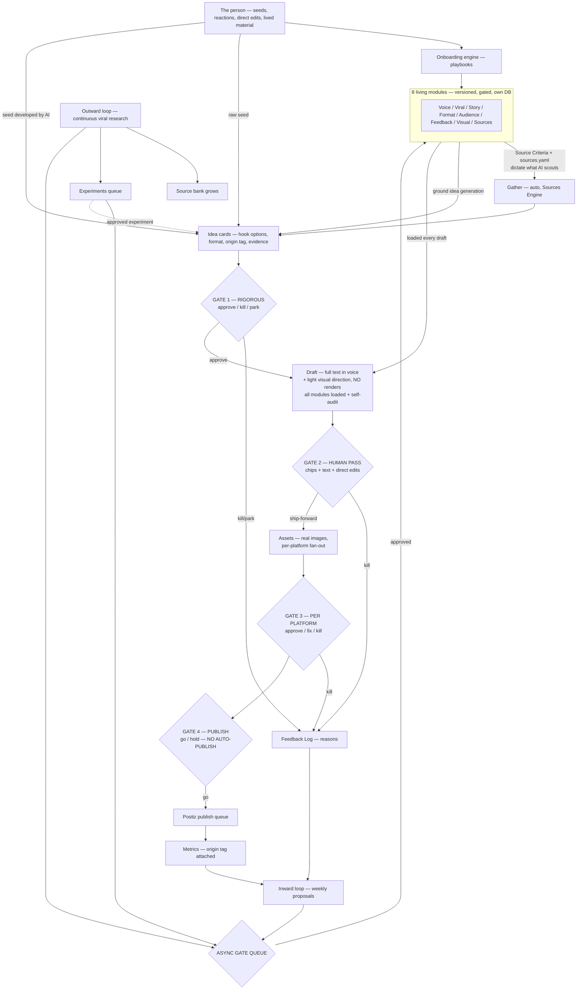

# Diagrams — ViralFactory

> **Living document.** Update when the system architecture changes.
> Current as of Charter v3.2 (AMENDMENT-003 — staged content pipeline).
> `stackpenni_v3_system_with_onboarding.png` is SUPERSEDED by this file + `system-overview-v3.2.svg` (it predates DIVERGENCE-002 — it still shows OB1 — and predates the staged pipeline).

## System Overview (vertical flow)

```
THE PERSON
seeds · reactions · direct edits · lived material
        │
        ▼
ONBOARDING ENGINE
generic playbook runner executes markdown procedures
        │
        ▼
8 LIVING MODULES (versioned, gate-only writes, own DB — no OB1)
Voice · Viral · Story · Format · Audience · Feedback · Visual · Sources
        │
        ▼
GATHER (automated) — CONFIGURED BY ONBOARDING
Sources Engine scouts what the person's onboarding inputs dictate:
seed sources + anti-examples → Source Criteria + sources.yaml
ingests + scores every item against those criteria
        │
        ▼
IDEAS  ◄── living modules ground idea generation
cards from 3 origins: ai-originated · human-seeded · human-seeded-ai-developed
ai-originated ideas = Source Bank material × Viral/Audience/Story/Format modules
each card: idea + hook options + format + origin tag + evidence links
        │
        ▼
■ GATE 1 — RIGOROUS: approve / kill / park per card
  the funnel kills most here, by design — kill reasons → Feedback Log
        │
        ▼
DRAFT
AI, all modules loaded, self-audits against Tells Checklist
= full text in voice + LIGHT VISUAL DIRECTION (prompts, refs, format)
  NO rendered images at this stage
        │
        ▼
■ GATE 2 — HUMAN PASS: chips + typed text + DIRECT EDITS (authoritative)
  AI revises → ship-forward or kill · edits → Feedback Log (highest weight)
        │
        ▼
ASSETS (survivors only)
real images generated per Visual Style Guide · captions rendered
fan-out to per-platform variants (X thread · IG carousel/reel · …)
        │
        ▼
■ GATE 3 — QUICK, PER PLATFORM: approve / fix / kill, side by side
        │
        ▼
■ GATE 4 — PUBLISH: go / hold + timing only
  NO AUTO-PUBLISH, EVER, AT ANY TRUST LEVEL — HARD RULE
        │
        ▼
SHIP → Postiz (self-hosted) publish queue → posted → metrics
        │
        ▼
LEARN
inward loop (weekly proposals) + outward loop (continuous research)
origin tag travels idea → nightly note: do human seeds outperform?
        │
        ▼
ASYNC GATE QUEUE
person clears when ready → approved = module version bump
        │
        ▼
NEXT DRAFT inherits updated modules
```

## Onboarding Flow (vertical) — unchanged

```
BUSINESS PROFILE Q&A
what the business is, brands, subjects, platforms, goals, red-lines
        │
        ▼
VOICE PROFILE
from materials (chat, voice notes, emails) or interview fallback
        │
        ▼
CALIBRATION GATE
3 samples → pick closest → react → revise (max 3)
        │
        ▼
SOURCES ENGINE
seed sources → criteria → monitoring plan → sources.yaml
        │
        ▼
VIRAL PATTERNS STARTER
admired examples + anti-examples → named patterns (hypotheses)
        │
        ▼
AUDIENCE INSIGHTS
who they are, what they respond to
        │
        ▼
STORY FRAMEWORKS
one framework per subject type, grounded in real examples
        │
        ▼
FORMAT GUIDE
message type × platform → format + skeleton
        │
        ▼
VISUAL STYLE
brand look + shot library + real-vs-generated blend rules
        │
        ▼
ALL 8 MODULES AT v1 — ONBOARDING COMPLETE
```

## Learning Loops (vertical) — unchanged

```
PUBLISHED PIECES + FEEDBACK LOG (incl. kill reasons from Gates 1–3)
        │
        ▼
INWARD LOOP (weekly)
AI analyzes results + reactions → proposes module updates with evidence
origin-tagged results: human-seeded vs ai-originated performance compared
        │
        ▼
ASYNC GATE QUEUE ←──── OUTWARD LOOP (continuous)
                     monitors top performers in domain
                     analyzes hook/structure/format/emotion/pacing
                     findings → Source Bank + proposals + Experiments Queue
        │
        ▼
USER CLEARS QUEUE WHEN READY
approve → module version bump with provenance
reject → logged with reason
        │
        ▼
NEXT DRAFT inherits all approved updates
```

## Mermaid (renders on GitHub)


