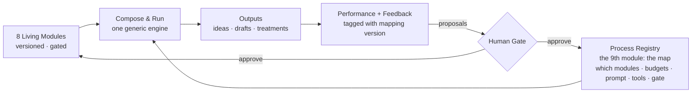

# AMENDMENT-005 — Processes Are Module Compositions
Version: 1.0 · Date: 2026-07-03 · Status: proposed (operator-approved in session; codify on merge)
Supersedes: nothing. Refines CHARTER-v3.3 architecture; constrains M3+ implementation.

## Principle

The essence of ViralFactory is a set of living modules whose state continuously improves through gated inward/outward learning. A **process** (ideation, drafting, treatment, research analysis) is not a route or a script — it is a **composition of modules**: a declarative spec naming which modules load, at what context budget, into which prompt, with which tools, producing which schema, behind which gate.

The mapping itself is data, not code. It is examinable and improvable by AI — through the gate, like everything else.

## Diagram



## What is already true (repo, 2026-07-03)

- Modules are first-class: `src/module_store.py` — versioned markdown in `modules/{slug}/`, schema-checked on load, gate-only writes.
- Prompts are composition templates with module slots (`prompts/draft/generate_v2.md` has `{voice_profile}`, `{viral_patterns}`, etc.).

## What is wrong today

- The module→prompt mapping is hardcoded inside route handlers (`src/app.py` ideas ~L3723, draft ~L4164): a hand-built variables dict with magic truncation slices (`[:3000]`, `[:2000]`).
- `_load_all_modules()` loads everything every time — the mapping question dodged, not answered.
- Each new process (treatments next) would accrete another parallel hand-written route. This is the process-first drift this amendment stops.

## Ruling

### R1 — Process Registry (data, not code)
Create `config/processes.yaml` (or `processes/*.yaml`). Each process is a spec:

```yaml
draft_generate:
  version: 1
  prompt: draft/generate_v2.md
  backend: drafter          # always via adapter backend param (BYO-AI hook)
  schema: DRAFT_SCHEMA
  gate: draft_review
  tools: []                 # e.g. [web_search] for research processes
  modules:
    voice-profile:      {budget: 3000, transform: null}
    voice-profile.tells: {budget: 1000, transform: extract_tells}
    story-frameworks:   {budget: 2000}
    audience-insights:  {budget: 2000}
    viral-patterns:     {budget: 2000}
    visual-style:       {budget: 2000}
    format-guide:       {budget: 2000}
  inputs: [idea, hook_options, origin, format_name, scope, capture_material]
```

### R2 — One compose-and-run engine
A single function loads the spec, pulls named modules at stated budgets, fills the prompt, calls the adapter, validates the schema. Ideas, draft, treatment become spec instances. Route handlers shrink to: auth/state checks → `run_process("draft_generate", inputs)` → store result. No per-process module wiring in Python.

### R3 — The registry is the 9th module
Same discipline as the other eight: versioned, provenance-tracked, **gate-only writes**. AI may examine the registry and propose mapping changes (add/drop a module, change a budget) with evidence — a proposal enters the M5 gate queue like any module proposal. **No self-modifying routing.** Every run logs the registry version used, so bad output is attributable to a specific mapping.

### R4 — Sequencing (unchanged priorities)
- Session memory + materials fixes, single-thread P0, gate tokens (T2.9) land first. Nothing here jumps that queue.
- Registry extraction happens when Hermes next touches the pipeline routes — it is the implementation vehicle for M3, not a new pre-M3 milestone.
- The AI-improves-the-mapping loop is **deferred to M5/M6** (it needs performance data attributed to mapping versions). M2/M3 only build the substrate: mappings as versioned data with run provenance.

## Build plan impact (BUILD_PLAN-v1.1)

- **M2**: task list unchanged. Add one task at the M2/M3 boundary — **T2.10 Extract hardcoded module→prompt mappings into `config/processes.yaml` + compose-and-run engine** — AC: ideas and draft routes contain zero inline module wiring; magic truncation slices gone; every provenance row records registry version.
- **M3 T3.2**: reword "seed + ALL modules → draft" → "seed + modules **per the draft process spec** → draft". Deliverable unchanged; implementation goes through the engine.
- **M5 T5.1/T5.2**: proposal job targets widen to include the process registry alongside the eight modules. Gate queue handles mapping proposals identically (evidence + exact diff).
- **M6**: outward-loop proposals may also target mappings (e.g. "load visual-style into ideation for this domain").
- **M7 T7.1**: strengthened — tenant #2 with different process wiring is a config difference, directly serving the zero-code-changes AC.
- No milestone reorder. No new milestones. Net effect: de-risks M7, gives M5 a cleaner substrate.

## Non-goals (for now)
- No generic plugin system, no dynamic tool marketplace, no per-tenant registry overrides until M7 forces them.
- No auto-applied mapping changes, ever. AI proposes; the human gates.
