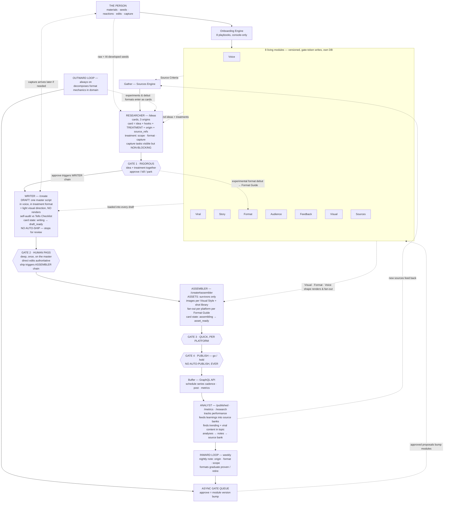

# System Diagrams — ViralFactory

*Destination: `docs/diagrams/README.md` · Authoritative overview, current as of **DIVERGENCE-006** (Writer/Assembler pipeline split + four-role menu + awaiting-capture removal). Supersedes v3.3 diagram.*

## Vertical flow (text)

```
THE PERSON ──────────────► ONBOARDING ENGINE (8 playbooks, console-only)
   │ materials · seeds ·            │
   │ reactions · edits ·            ▼
   │ capture                 8 LIVING MODULES ◄──────────────────────────┐
   │                         (versioned · gate-token writes · own DB)    │
   ▼                                │                                    │
GATHER — Sources Engine  ◄── Source Criteria + sources.yaml              │
   ▼                                                                     │
┌─────────────────────────────────────────────────────────────────────┐
│  RESEARCHER (AI Profile) — /ideas                                     │
│  IDEAS — cards, 3 origins  ◄── modules ground ideas + treatments      │
│  card = idea + hooks + TREATMENT + origin + source_refs               │
│  treatment = scope (one-off | series-of-N | pillar) · format · capture │
│  capture tasks shown on card but NO LONGER BLOCK the pipeline         │
└─────────────────────────────────────────────────────────────────────┘
   ▼
■ GATE 1 — RIGOROUS: idea + treatment approved TOGETHER
   · approve / kill / park — most die here, by design
   · experimental formats may DEBUT in a treatment — approval
     writes the format to the Format Guide (status: experimental) ───────┤
   · APPROVE triggers WRITER chain (not full chain)                      │
   ▼                                                                     │
┌─────────────────────────────────────────────────────────────────────┐
│  WRITER (AI Profile = Drafter) — /create                              │
│  DRAFT — ONE master script  ◄── all modules loaded into every draft    │
│  full text in voice, in the treatment's format + light visual          │
│  direction (NO renders) · self-audit vs Tells Checklist                │
│  Card state: writing → draft_ready                                      │
│  NO AUTO-SHIP — stops for human review                                 │
└─────────────────────────────────────────────────────────────────────┘
   ▼
■ GATE 2 — HUMAN PASS: deep, once, on the master
   chips + text + DIRECT EDITS (authoritative) → ship / kill
   · SHIP triggers ASSEMBLER chain (not done at Gate 1)                   │
   ▼                                                                     │
┌─────────────────────────────────────────────────────────────────────┐
│  ASSEMBLER (AI Profile = Drafter) — /create#assembler                  │
│  ASSETS — survivors only  ◄── Visual Style + Format Guide + Voice      │
│  real images per Visual Style Guide + shot library · captions          │
│  in voice · per-platform fan-out per Format Guide                      │
│  Card state: assembling → asset_ready                                  │
└─────────────────────────────────────────────────────────────────────┘
   ▼
■ GATE 3 — QUICK, PER PLATFORM: approve / fix / kill
   ▼
■ GATE 4 — PUBLISH: go / hold · NO AUTO-PUBLISH, EVER (HARD RULE)
   ▼
SHIP → BUFFER (GraphQL API) — schedule (series cadence dates) · post
   ▼
┌─────────────────────────────────────────────────────────────────────┐
│  ANALYST (AI Profile) — /published + /metrics + /research              │
│  tracks performance · feeds learnings into source banks                │
│  continues finding sources on topic (old + new news, trending,         │
│  viral content in same topic area) → analyses → notes → source bank    │
└─────────────────────────────────────────────────────────────────────┘
   ▼
INWARD LOOP (weekly)                 OUTWARD LOOP (always on)
   nightly note: origin · format ·      decomposes format mechanics
   scope per piece · Feedback Log       in domain: what works, how,
   (direct edits highest) · formats     for what messaging & audience
   graduate proven / retire                 │                            │
        └──────────► ASYNC GATE QUEUE ◄─────┘                            │
                     approve = module version bump ──────────────────────┘
                     NEXT DRAFT inherits updated modules
   kill reasons (gates 1–3) → Feedback Log → inward loop
   approved experiments & debut-format proposals enter as idea cards
```

## Mermaid (renders on GitHub)



## What changed v3.3 → DIVERGENCE-006

1. **Writer/Assembler pipeline split.** Gate 1 approval no longer triggers the full chain (draft → fan-out → assets). It triggers the **Writer** only (draft generation, stops at `draft_ready`). The **Assembler** (fan-out → assets) triggers when the operator ships the draft at Gate 2. This restores Gate 2 as a real human review checkpoint — T8.6 had bypassed it.
2. **Awaiting-capture removed.** Cards with capture tasks no longer enter a separate `awaiting_capture` blocking state. They go straight to `approved` → Writer → Assembler. Real photos arrive later and update the asset; the Assembler creates what it can with generated media.
3. **Four-role menu.** The operator-facing navigation now reflects four roles: **Researcher** (/ideas) → **Writer** (/create) → **Assembler** (/create#assembler) → **Analyst** (/published). These map to the existing AI Profiles (Researcher, Drafter, Analyst). The Drafter profile covers both Writer and Assembler stages.
4. **Analyst expanded scope.** The Analyst now owns publishing, performance tracking, and the source-bank feedback loop (finding trending + viral content in the topic area, analysing, entering into source banks). Previously these were separate stages; the operator's vision merges them under one role.
5. **Postiz → Buffer.** Publishing backend updated from Postiz to Buffer (GraphQL API).
6. **Card states renamed.** `producing` → `writing` (Writer stage) and `assembling` (Assembler stage). `production_failed` → `writer_failed` / `assembly_failed` (legacy state preserved for backward compat).

## Card state machine (full lifecycle)

```
new ──approve──► approved ──writer chain──► writing ──draft ready──► draft_ready
                                                                              │
                                                              ┌─── ship ──────┘
                                                              ▼
                                                    assembling ──fan-out done──► asset_ready
                                                                              │
                                                              ┌── approve asset ┘
                                                              ▼
                                                          drafted ──publish──► published
                  parked ◄──park── new
                  killed ◄──kill── new
                          ◄──kill── draft_ready (Gate 2)
                          ◄──kill── asset_ready (Gate 3)

                  writer_failed ◄──writer chain error── writing
                  assembly_failed ◄──assembler chain error── assembling
                          └──retry──► writing | assembling
```

## How a card propagates (step by step)

```
1. RESEARCHER generates idea card (from Source Bank × modules, or human seed)
   → card state: new
   → card carries: idea + hook options + treatment (scope, format, capture) + source_refs

2. OPERATOR reviews at /ideas (Gate 1)
   → approve / kill / park
   → on approve: card state → approved → writer chain enqueued

3. WRITER chain runs (background)
   → card state: approved → writing → draft_ready
   → draft generated: full text in voice + visual direction + self-audit flags
   → NO auto-ship, NO fan-out — stops for human review

4. OPERATOR reviews at /create (Gate 2 — Writer section)
   → chips + text feedback + direct edits (authoritative)
   → revise (regenerate) / kill / ship
   → on ship: card state → drafted → assembler chain enqueued

5. ASSEMBLER chain runs (background)
   → card state: drafted → assembling → asset_ready
   → fan-out: per-platform variants (X thread, IG carousel, reel, etc.)
   → each variant: content + posts + image prompts

6. OPERATOR reviews at /create#assembler (Gate 3 — Assembler section)
   → approve / fix / kill per platform variant
   → generate images / render video if needed

7. OPERATOR publishes at Gate 4
   → go / hold + timing
   → NO AUTO-PUBLISH, EVER — hard rule
   → card state → published

8. ANALYST tracks performance
   → /published, /metrics, /research
   → finds new sources (trending, viral in topic) → enters into source bank
   → inward loop (weekly): proposals → async gate queue → module bumps
   → outward loop (always on): viral pattern decomposition → source bank
   → NEXT draft inherits updated modules — the system learns
```