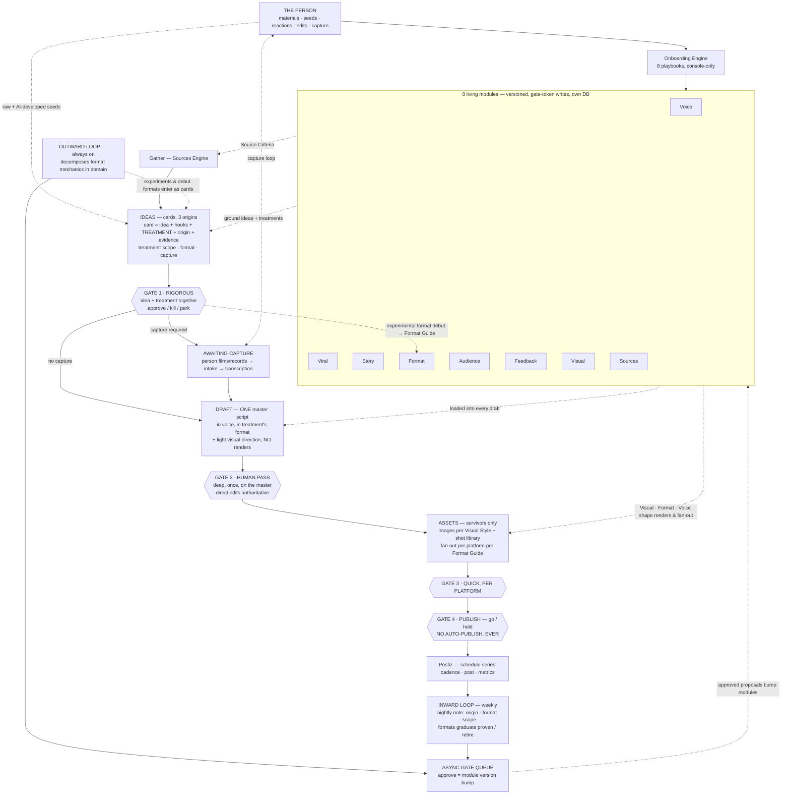

# System Diagrams — ViralFactory

*Destination: `docs/diagrams/README.md` (replaces prior version) · Authoritative overview, current as of **Charter v3.3** (AMENDMENT-004). SVG: `system-overview-v3.3.svg`. The v3.2 SVG is superseded — leave in place for history.*

## Vertical flow (text)

```
THE PERSON ──────────────► ONBOARDING ENGINE (8 playbooks, console-only)
   │ materials · seeds ·            │
   │ reactions · edits ·            ▼
   │ capture                 8 LIVING MODULES ◄──────────────────────────┐
   │                         (versioned · gate-token writes · own DB)    │
   ▼                                │                                    │
GATHER — Sources Engine  ◄── Source Criteria + sources.yaml              │
   ▼                                                                     │
IDEAS — cards, 3 origins  ◄── modules ground ideas + treatments          │
   card = idea + hooks + TREATMENT + origin + evidence                   │
   treatment = scope (one-off | series-of-N | pillar) · format · capture │
   ▼                                                                     │
■ GATE 1 — RIGOROUS: idea + treatment approved TOGETHER                  │
   · approve / kill / park — most die here, by design                    │
   · experimental formats may DEBUT in a treatment — approval            │
     writes the format to the Format Guide (status: experimental) ───────┤
   ▼                                                                     │
AWAITING-CAPTURE (only if treatment requires it)                         │
   person films/records → materials intake → audio transcribed           │
   capture_required = none → passes straight through                     │
   ▼                                                                     │
DRAFT — ONE master script  ◄── all modules loaded into every draft       │
   full text in voice, in the treatment's format + light visual          │
   direction (NO renders) · self-audit vs Tells Checklist                │
   ▼                                                                     │
■ GATE 2 — HUMAN PASS: deep, once, on the master                         │
   chips + text + DIRECT EDITS (authoritative) → ship / kill             │
   ▼                                                                     │
ASSETS — survivors only  ◄── Visual Style + Format Guide + Voice         │
   real images per Visual Style Guide + shot library · captions          │
   in voice · per-platform fan-out per Format Guide                      │
   ▼                                                                     │
■ GATE 3 — QUICK, PER PLATFORM: approve / fix / kill                     │
   ▼                                                                     │
■ GATE 4 — PUBLISH: go / hold · NO AUTO-PUBLISH, EVER (HARD RULE)        │
   ▼                                                                     │
SHIP → POSTIZ (self-hosted) — schedule (series cadence dates) · post     │
   ▼                                                                     │
INWARD LOOP (weekly)                 OUTWARD LOOP (always on)            │
   nightly note: origin · format ·      decomposes format mechanics      │
   scope per piece · Feedback Log       in domain: what works, how,      │
   (direct edits highest) · formats     for what messaging & audience    │
   graduate proven / retire                 │                            │
        └──────────► ASYNC GATE QUEUE ◄─────┘                            │
                     approve = module version bump ──────────────────────┘
                     NEXT DRAFT inherits updated modules
   kill reasons (gates 1–3) → Feedback Log → inward loop
   approved experiments & debut-format proposals enter as idea cards
```

## Mermaid (renders on GitHub)



## What changed v3.2 → v3.3

1. Idea cards carry a **treatment** (scope · format · capture · reuse · rationale), approved with the idea at Gate 1.
2. **Awaiting-capture** state between Gate 1 and Draft, with the person's capture loop through materials intake + transcription.
3. **Experimental format debut**: Gate-1 approval of a debut treatment writes the format to the Format Guide (experimental → proven/retired via inward loop).
4. **Modules → Assets arrow added** (operator-spotted omission): Visual Style Guide + shot library, Format Guide fan-out mechanics, and Voice Profile captions all shape asset creation. The arrow documents existing behavior, not new behavior.
5. Nightly note carries `format` and `scope` alongside `origin`; series cadence dates land at the Postiz scheduling step, still behind Gate 4.
