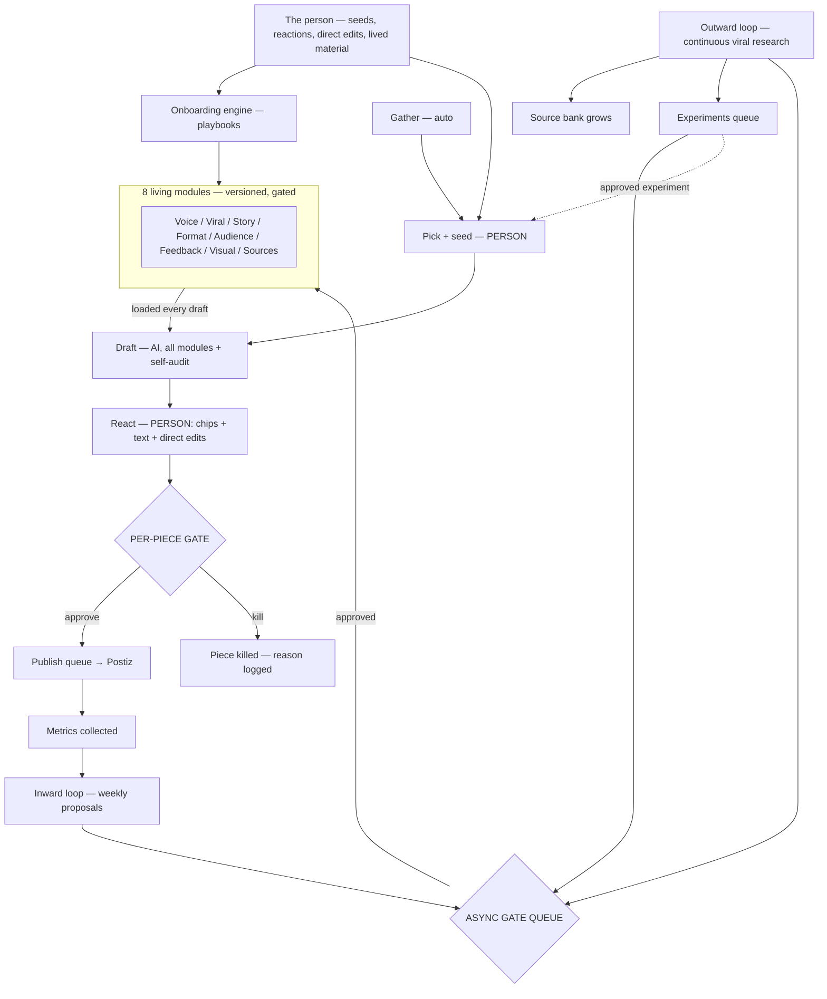

# Diagrams — ViralFactory

> **Living document.** Update when the system architecture changes.

## System Overview (vertical flow)

```
THE PERSON
seeds · reactions · direct edits · lived material
        │
        ▼
ONBOARDING ENGINE
generic playbook runner executes markdown procedures
        │
        ▼
8 LIVING MODULES (versioned, gate-only writes)
Voice · Viral · Story · Format · Audience · Feedback · Visual · Sources
        │
        ▼
DRAFT
AI loads modules + self-audits against Tells Checklist
        │
        ▼
REACT
user: chips + typed text + direct edits → Feedback Log
        │
        ▼
APPROVE (per-piece gate — every piece, every time)
        │
        ▼
SHIP → Postiz publish queue (scheduled)
        │
        ▼
PUBLISH
        │
        ▼
LEARN
inward loop (weekly proposals) + outward loop (continuous research)
        │
        ▼
ASYNC GATE QUEUE
Daimon clears when ready → approved = module version bump
        │
        ▼
NEXT DRAFT inherits updated modules
```

## Onboarding Flow (vertical)

```
BUSINESS PROFILE Q&A
what the business is, brands, subjects, platforms, goals, red-lines
        │
        ▼
VOICE PROFILE
from materials (chat, voice notes, emails) or interview fallback
        │
        ▼
CALIBRATION GATE
3 samples → pick closest → react → revise (max 3)
        │
        ▼
SOURCES ENGINE
seed sources → criteria → monitoring plan → sources.yaml
        │
        ▼
VIRAL PATTERNS STARTER
admired examples + anti-examples → named patterns (hypotheses)
        │
        ▼
AUDIENCE INSIGHTS
who they are, what they respond to
        │
        ▼
STORY FRAMEWORKS
one framework per subject type, grounded in real examples
        │
        ▼
FORMAT GUIDE
message type × platform → format + skeleton
        │
        ▼
VISUAL STYLE
brand look + shot library + real-vs-generated blend rules
        │
        ▼
ALL 8 MODULES AT v1 — ONBOARDING COMPLETE
```

## Learning Loops (vertical)

```
PUBLISHED PIECES + FEEDBACK LOG
        │
        ▼
INWARD LOOP (weekly)
AI analyzes results + reactions → proposes module updates with evidence
        │
        ▼
ASYNC GATE QUEUE ←──── OUTWARD LOOP (continuous)
                     monitors top performers in domain
                     analyzes hook/structure/format/emotion/pacing
                     findings → Source Bank + proposals + Experiments Queue
        │
        ▼
USER CLEARS QUEUE WHEN READY
approve → module version bump with provenance
reject → logged with reason
        │
        ▼
NEXT DRAFT inherits all approved updates
```

## Mermaid (renders on GitHub)

